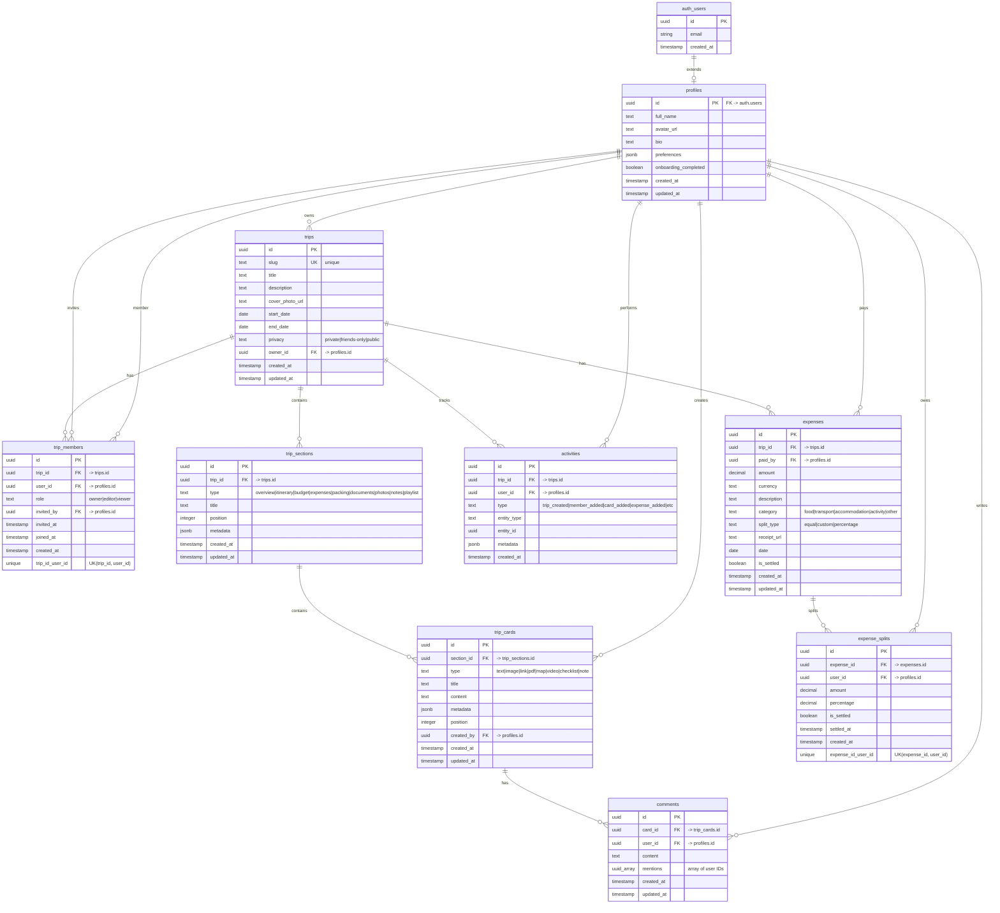

# TravelNest Database ERD (Entity Relationship Diagram)

## Overview

This document provides a visual representation of the TravelNest database schema, showing all entities (tables) and their relationships.

## Entity Relationship Diagram

## Table Descriptions

### Core User Tables

#### `auth.users` (Supabase Auth)
- **Managed by:** Supabase Auth system
- **Purpose:** Authentication and user management
- **Key Fields:** `id` (UUID, primary key), `email`

#### `profiles`
- **Purpose:** Extended user profile with TravelNest-specific data
- **Relationships:**
  - One-to-one with `auth.users` (via `id`)
  - One-to-many with `trips` (as owner)
  - Many-to-many with `trips` (via `trip_members`)
- **Key Fields:**
  - `preferences` (JSONB): Stores onboarding data (travelGroup, vibe, budgetLevel, interests, defaultCurrency)
  - `onboarding_completed`: Tracks if user completed onboarding

### Trip Management Tables

#### `trips`
- **Purpose:** Core trip entity - the main board for each trip
- **Relationships:**
  - Many-to-one with `profiles` (owner)
  - One-to-many with `trip_members`, `trip_sections`, `expenses`, `activities`
- **Key Fields:**
  - `slug`: Unique URL-friendly identifier (e.g., "paris-2024-dec")
  - `privacy`: Controls visibility (private, friends-only, public)
  - `start_date`, `end_date`: Trip duration

#### `trip_members`
- **Purpose:** Many-to-many relationship between users and trips with permissions
- **Relationships:**
  - Many-to-one with `trips`
  - Many-to-one with `profiles` (member)
  - Many-to-one with `profiles` (inviter)
- **Key Fields:**
  - `role`: Permission level (owner, editor, viewer)
  - Unique constraint on `(trip_id, user_id)` to prevent duplicates

#### `trip_sections`
- **Purpose:** Sections within a trip board (Overview, Itinerary, Budget, etc.)
- **Relationships:**
  - Many-to-one with `trips`
  - One-to-many with `trip_cards`
- **Key Fields:**
  - `type`: Predefined section types (overview, itinerary, budget, expenses, packing, documents, photos, notes, playlist)
  - `position`: Order of sections (drag & drop support)
  - `metadata`: Additional section-specific data (JSONB)

#### `trip_cards`
- **Purpose:** Rich content cards within sections (text, images, links, PDFs, maps, etc.)
- **Relationships:**
  - Many-to-one with `trip_sections`
  - Many-to-one with `profiles` (creator)
  - One-to-many with `comments`
- **Key Fields:**
  - `type`: Card content type (text, image, link, pdf, map, video, checklist, note)
  - `metadata`: Stores URLs, coordinates, checklist items, etc. (JSONB)
  - `position`: Order within section

### Expense Tracking Tables

#### `expenses`
- **Purpose:** Individual expense entries for a trip
- **Relationships:**
  - Many-to-one with `trips`
  - Many-to-one with `profiles` (payer)
  - One-to-many with `expense_splits`
- **Key Fields:**
  - `amount`: Expense amount
  - `currency`: Currency code (default: PKR)
  - `split_type`: How to split (equal, custom, percentage)
  - `receipt_url`: Link to uploaded receipt image
  - `is_settled`: Whether expense has been fully paid

#### `expense_splits`
- **Purpose:** Individual user's portion of an expense
- **Relationships:**
  - Many-to-one with `expenses`
  - Many-to-one with `profiles` (user who owes)
- **Key Fields:**
  - `amount`: User's share of the expense
  - `percentage`: For percentage-based splits
  - `is_settled`: Whether this user has paid their share
  - Unique constraint on `(expense_id, user_id)`

### Collaboration Tables

#### `comments`
- **Purpose:** Comments on trip cards with @mention support
- **Relationships:**
  - Many-to-one with `trip_cards`
  - Many-to-one with `profiles` (commenter)
- **Key Fields:**
  - `mentions`: Array of user IDs mentioned in comment
  - `content`: Comment text

#### `activities`
- **Purpose:** Activity feed for real-time updates and notifications
- **Relationships:**
  - Many-to-one with `trips`
  - Many-to-one with `profiles` (actor, nullable)
- **Key Fields:**
  - `type`: Activity type (trip_created, member_added, card_added, expense_added, etc.)
  - `entity_type`, `entity_id`: Reference to the affected entity
  - `metadata`: Additional activity data (JSONB)

## Relationship Summary

### One-to-Many Relationships
- `profiles` → `trips` (owner relationship)
- `trips` → `trip_sections`
- `trips` → `expenses`
- `trips` → `activities`
- `trip_sections` → `trip_cards`
- `trip_cards` → `comments`
- `expenses` → `expense_splits`
- `profiles` → `trip_cards` (creator)
- `profiles` → `expenses` (payer)
- `profiles` → `comments` (author)

### Many-to-Many Relationships
- `profiles` ↔ `trips` (via `trip_members`)
  - Junction table: `trip_members`
  - Attributes: `role`, `invited_by`, `invited_at`, `joined_at`

### Key Constraints
- **Unique Constraints:**
  - `trips.slug` (unique trip identifier)
  - `trip_members(trip_id, user_id)` (one membership per user per trip)
  - `expense_splits(expense_id, user_id)` (one split per user per expense)

- **Check Constraints:**
  - `trips.privacy`: Must be 'private', 'friends-only', or 'public'
  - `trip_members.role`: Must be 'owner', 'editor', or 'viewer'
  - `trip_sections.type`: Must be one of 9 predefined types
  - `trip_cards.type`: Must be one of 8 predefined types
  - `expenses.split_type`: Must be 'equal', 'custom', or 'percentage'

## Indexes

### Performance Indexes
- `trips`: `owner_id`, `slug`, `(start_date, end_date)`
- `trip_members`: `trip_id`, `user_id`
- `trip_sections`: `trip_id`, `(trip_id, position)`
- `trip_cards`: `section_id`, `(section_id, position)`
- `expenses`: `trip_id`, `paid_by`, `date`
- `expense_splits`: `expense_id`, `user_id`
- `comments`: `card_id`, `user_id`
- `activities`: `trip_id`, `(trip_id, created_at DESC)`

## Row-Level Security (RLS)

All tables have RLS enabled with policies that ensure:
- Users can only access trips they're members of
- Editors can modify content, Viewers can only read
- Trip owners have full control
- Users can only modify their own comments
- System can create activities (via service role)

## Data Flow Examples

### Creating a Trip
1. User creates `trip` record (becomes owner)
2. System creates 9 default `trip_sections` (overview, itinerary, budget, etc.)
3. System creates `trip_members` record with role='owner'
4. System creates `activity` record (type='trip_created')

### Adding an Expense
1. User creates `expense` record
2. System creates `expense_splits` records for each member (based on split_type)
3. System creates `activity` record (type='expense_added')
4. Real-time updates notify all trip members

### Collaborative Editing
1. User edits `trip_card` content
2. System creates `activity` record (type='card_updated')
3. Supabase Realtime broadcasts change to all connected clients
4. Other users see live update without refresh

## Notes

- All timestamps use `TIMESTAMPTZ` (timezone-aware)
- All UUIDs use `uuid_generate_v4()` for generation
- JSONB fields allow flexible schema for metadata
- Foreign keys use `ON DELETE CASCADE` or `ON DELETE SET NULL` appropriately
- `updated_at` fields are automatically maintained via triggers

